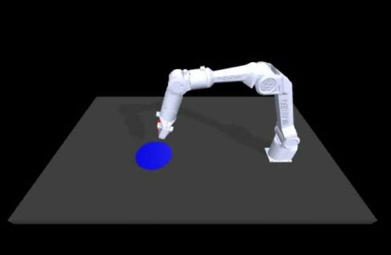

# 深蓝学院 Project 1

# ACT with AGILE·X PiPER 🦾

注：本次课程更新适配松灵机械臂PiPER，为学员带来更真实的操作体验。

> ⚙️ **系统建议：使用 Ubuntu 20.04 环境进行开发与实验**，以确保软件兼容性与依赖稳定性。

## 完成此Project后，你将：

- 掌握Conda虚拟环境的创建与基本操作。
- 学会使用 MuJoCo 物理引擎模拟机械臂任务并生成训练数据集。
- 理解整个ACT代码的基本原理，掌握其训练策略模型的全流程。
- 理解模型中超参数对训练稳定性与最终效果的影响并掌握如何优化模型性能。

## 你的任务：

使用ACT在 MuJoCo 仿真环境中训练松灵的机械臂PiPER，让它能够抓起红色方块并且成功放在蓝色圆盘上。



Reward分布：

- 夹爪碰到方块：reward=1
- 成功夹起方块：reward=2
- 成功将方块放置在蓝色盘子上：reward=3

看看你能不能让机械臂总是拿到3分的满分呢？

## 任务步骤：

#### Step1. 配置ACT所需的conda环境：
    1. 下载anaconda：[https://www.anaconda.com/download/success](https://www.anaconda.com/download/success)
    2. 在Terminal中执行以下命令，创建名为project1_act的环境并且安装所需的依赖。

    ```bash
    conda create -n project1_act python=3.8.10
    conda activate project1_act
    pip install torchvision
    pip install torch
    pip install pyquaternion
    pip install pyyaml
    pip install rospkg
    pip install pexpect
    pip install mujoco==2.3.7
    pip install dm_control==1.0.14
    pip install opencv-python
    pip install matplotlib
    pip install einops
    pip install packaging
    pip install h5py
    pip install ipython
    cd act_agilex_piper/detr && pip install -e .
    ```

#### Step2. 使用脚本生成训练数据：

    打开Terminal，在act_agilex_piper目录下运行以下命令

    ```bash
    python3 record_sim_episodes_piper.py --task_name sim_pick_n_place_cube_scripted --dataset_dir data/sim_pick_n_place_cube_scripted --num_episodes 50
    
    # 如果你想观看实时渲染，那就多加一个如下flag：
    --onscreen_render
    ```

#### Step3. 查看生成好的训练数据：

    ```bash
    python3 visualize_episodes.py --dataset_dir data/sim_pick_n_place_cube_scripted --episode_idx 0 # 此处选取你想要视频查看的episode的序列号
    ```

#### Step4. 训练：

    ```bash
    python3 imitate_episodes.py \
    --task_name sim_pick_n_place_cube_scripted \
    --ckpt_dir ckpt_dir --policy_class ACT \
    --kl_weight 10 --chunk_size 100 \
    --hidden_dim 512 --batch_size 8 \
    --dim_feedforward 3200 --num_epochs 2000 \
    --lr 1e-5 --seed 0 --temporal_agg
    ```

#### Step5. 评估训练结果：

    ```bash
    python3 imitate_episodes.py \
    --task_name sim_pick_n_place_cube_scripted \
    --ckpt_dir ckpt_dir --policy_class ACT \
    --kl_weight 10 --chunk_size 100 \
    --hidden_dim 512 --batch_size 8 \
    --dim_feedforward 3200 --num_epochs 2000 \
    --lr 1e-5 --seed 0 --temporal_agg --eval
    ```

**Step6.** 此时如果你完成按照所给的超级参数来训练，你会发现拿到3分满分的概率低于60%，这时候你需要通过调参来提⾼成功概率。将你所得到的成功率分享在评论区/课程官方答疑交流群里吧。

**Step7.**（可选）：使⽤docker训练和运⾏试验 https://github.com/Weijing/robot_project/tree/main/docker_act

**Step8.**（可选）：观察你生成的训练数据视频，你有没有想到什么不同寻常的方法来提高成功率呢？