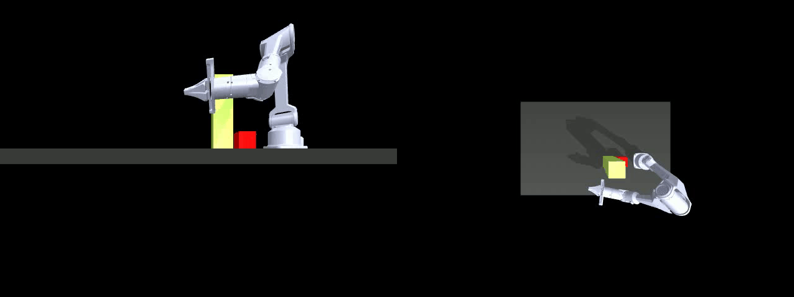
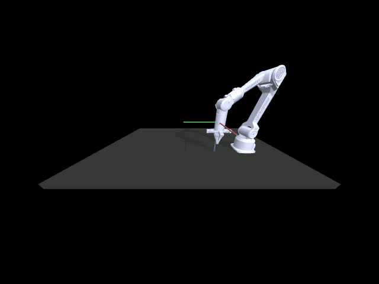

# 深蓝学院 Project 2 
# 基于RRT算法的AGILE·X PiPER机械臂路径规划

## 完成此Project后，你将：

- 理解 RRT 路径规划算法在 6 自由度机械臂上的实现方式
- 发现 RRT 算法的局限性，尝试常见的改进方法以提升路径规划性能
- 掌握使用逆运动学（IK）从目标末端位姿求解关节角度的方法
- 熟练运用 MuJoCo 仿真平台，将 RRT 与 IK 相结合，完成机械臂的抓取任务，并实现数据采集以支持后续训练
---

## 你的任务

### Task 1 基于 RRT 的机械臂路径规划与物体抓取

#### Step 1: 理解RRT算法，跑通代码  
- 启动Project 1中配置好的Conda环境：`conda activate project1_act`
- 运行 RRT 脚本文件并观察是否成功找到路径：`python3 rrt_piper_original.py`
- 查看生成演示视频`rrt_robot_motion_ori.mp4`，并评估路径规划效果
- 路径规划示意图：绕开障碍物
  

#### Step 2: 提升RRT算法性能
- 原始 RRT 算法在路径规划过程中成功率较低，且通常需要较长的计算时间
- 基于原始 RRT，采用改进算法（如 RRT* 或 RRT-Connect）以提升路径规划的效率与成功率

#### Step 3: 实现物体抓取路径执行并生成仿真演示
- 基于路径规划结果，实现已知目标位姿的物体抓取
- 参考脚本`rrt_piper_advance.py`，完成其中标记`#TODO`的部分代码
- 运行前需要安装以下依赖：`pip install ikpy transformations` 
- 查看生成的演示视频 `rrt_robot_motion_2.mp4`，评估抓取过程效果
- 示意图如下：
- RRT路径规划后移动至物体上方
- 执行抓取动作
- 移动至目标机械臂位置

### Task 2 基于IK的路径规划与数据采集（可选）

> ⚠️ **说明：本任务为拓展练习，无需提交作业，仅供大家根据兴趣自行尝试。**
#### Step 1: 实现物体抓取并且录制数据
- 在 MuJoCo 仿真环境中搭建抓取物体的机械臂任务场景
- 运行脚本 `python3 ik.py` ，程序将随机生成十组目标位姿，并使用 IK 解算器求解对应关节角度，生成演示视频  `ik.mp4` 
- 
- 在完成路径规划与 IK 解算的基础上，设计并构建完整的pipeline，用于记录机械臂抓取过程的数据，为后续模型训练提供支持

#### Step 2: 完善数据采集的pipeline
- 在不同场景中完成抓取任务，包括多个位置与多种物体，完成抓取过程的数据录制
- 与 Project 1 相结合，实现带避障能力的通用数据采集流程