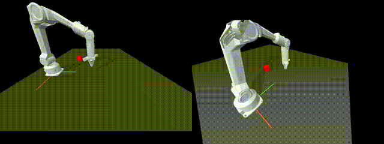
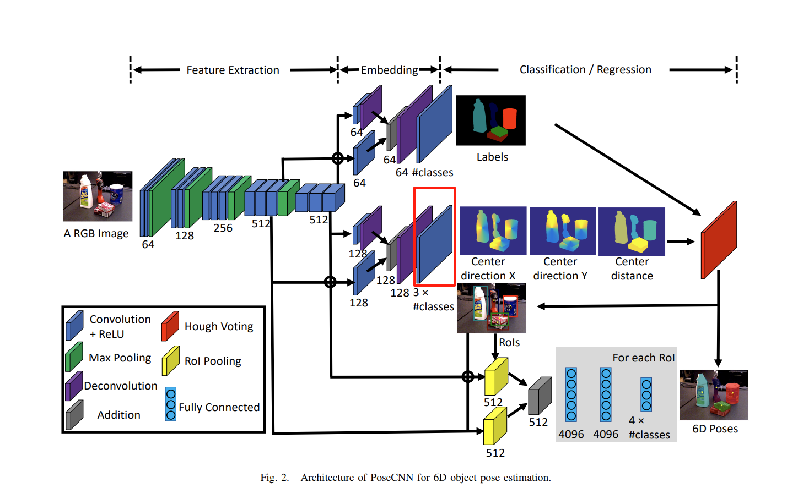

# 深蓝学院 Project 3
# PoseCNN 6D姿态估计与抓取

## 完成此Project后，你将：
- 学会使用 PoseCNN 进行 6D 姿态估计，提取图像特征并实现物体分割与定位
  
- 掌握 PoseCNN + 逆运动学IK + RRT 路径规划，实现目标物体抓取任务

---
## 你的任务

**Step 1：环境配置**
请阅读 environment.yml 文件了解环境配置，使用 conda 创建相应的环境：
~~~bash
conda env create -f environment.yml
~~~

进入到posecnn环境后补充安装与 Project 2 中相同的 PiPER 机械臂仿真环境依赖：
~~~bash
pip install mujoco==2.3.7 dm_control==1.0.14 ikpy transformations
~~~

**Step 2：数据集下载**

下载数据集：PROPS-Pose-Dataset.tar.gz，解压后放在p3_pose/data/PROPS-Pose-Dataset/目录下

[数据集下载链接](https://pan.baidu.com/s/1WYyfJvNFmu7qoLIoFuD1Gw?pwd=dkfv)

提取码: dkfv

## Task 1：基于PoseCNN论文实现代码

1.阅读 PoseCNN 论文pose_estimation_final_example.pdf，完成 `pose_cnn.py` 文件中 TODO 部分的代码填充

2.填充完代码后，运行 `pose_estimation.ipynb` ，实现数据集加载、训练及推理

### 参考运行

成功实现 PoseCNN 后，参考运行结果请查看 PoseCNN 论文

## Task 2：使用PoseCNN进行机械臂RRT规划与抓取

1.在 `rrt_piper_grasp.py` 文件中完成 TODO 部分的代码填充

2.完成代码填充后，运行 `rrt_piper_grasp.py`，实现完整pipeline，成功运行会显示出如`rrt_posecnn_grasp.mp4`所示的演示视频

---

> ⚠️ **细节注意：做位姿估计的conv+relu层，论文中说明不完善**

在原文《PoseCNN: A Convolutional Neural Network for 6D Object Pose Estimation in Cluttered Scenes》中有画 PoseCNN 的结构图，图示中所有蓝色方块都是`Conv+ReLU`，但是实际上，下图中红色框出的部分只能是Conv层，后续不能加ReLU，因为需要保留正负值做姿态估计，因此不能用ReLU把负值去掉，所以蓝色块代码实现只用一个Conv层，输出直接给到位姿估计loss。
在原文《PoseCNN: A Convolutional Neural Network for 6D Object Pose Estimation in Cluttered Scenes》中，网络结构图中将所有蓝色模块统一标注为“Conv + ReLU”。但需要特别注意的是，图中红色框标出的部分实际上只能使用Conv层而不加 ReLU 激活函数。这是因为该部分用于进行姿态估计，输出的特征需要保留正负值信息，若使用 ReLU 会导致负值被截断，从而影响位姿预测的准确性。因此，在代码实现中，这些蓝色模块仅包含卷积操作，其输出将直接用于计算位姿估计loss

